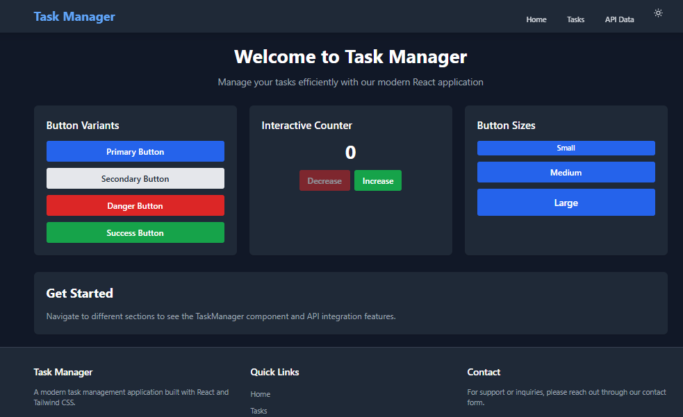

# Task Manager - React.js and Tailwind CSS Application

A modern, responsive task management application built with React, Vite, and Tailwind CSS. This application demonstrates component architecture, state management with hooks, API integration, and beautiful UI design.

## 🌐 Live Demo

🔗 **Deployment URL:** https://react-js-jsx-and-css-mastering-front-end-development-keibx8be3.vercel.app

## 📸 Screenshots

### Home Page

*Welcome page showcasing button variants and interactive components*

### Task Manager

*Full-featured task management with filtering and localStorage persistence*

### API Data Integration

*Posts from JSONPlaceholder API with search and pagination*

### Dark Mode

*Beautiful dark theme with seamless transitions*

## 🚀 Features

- ✅ **Task Management**: Create, complete, and delete tasks with filtering
- ✅ **Theme Support**: Light/Dark mode with smooth transitions
- ✅ **API Integration**: Fetch and display data from JSONPlaceholder API
- ✅ **Search Functionality**: Real-time search through posts
- ✅ **Pagination**: Navigate through paginated API results
- ✅ **Responsive Design**: Mobile-first design that works on all devices
- ✅ **Animations**: Smooth transitions and hover effects
- ✅ **localStorage Persistence**: Tasks and theme preferences persist across sessions

## 🛠️ Tech Stack

- **React 19** - UI library
- **Vite** - Build tool and development server
- **Tailwind CSS 3** - Utility-first CSS framework
- **React Router** - Client-side routing
- **PropTypes** - Type checking for React components

## 📋 Prerequisites

Before you begin, ensure you have the following installed:

- **Node.js** (v18 or higher) - [Download](https://nodejs.org/)
- **npm** or **yarn** - Comes with Node.js
- **Git** - [Download](https://git-scm.com/)

## 🔧 Installation & Setup

### Step 1: Clone the Repository

```bash
git clone https://github.com/yourusername/react-task-manager.git
cd react-task-manager
```

### Step 2: Install Dependencies

```bash
npm install
```

This will install all required dependencies including:
- React and React DOM
- Vite and React plugins
- Tailwind CSS and PostCSS
- React Router DOM
- PropTypes

### Step 3: Start the Development Server

```bash
npm run dev
```

The application will start at `http://localhost:5173`

### Step 4: Build for Production

```bash
npm run build
```

This creates an optimized production build in the `dist/` directory.

### Step 5: Preview Production Build

```bash
npm run preview
```

## 📁 Project Structure

```
react-task-manager/
├── public/                 # Static assets
├── src/
│   ├── api/               # API integration functions
│   │   └── jsonPlaceholder.js
│   ├── components/        # Reusable UI components
│   │   ├── Button.jsx
│   │   ├── Card.jsx
│   │   ├── Footer.jsx
│   │   ├── Layout.jsx
│   │   ├── Navbar.jsx
│   │   ├── PostCard.jsx
│   │   └── TaskManager.jsx
│   ├── context/           # React Context providers
│   │   └── ThemeContext.jsx
│   ├── hooks/             # Custom React hooks
│   │   └── useLocalStorage.js
│   ├── pages/             # Page components
│   │   ├── APIData.jsx
│   │   └── Tasks.jsx
│   ├── utils/             # Utility functions
│   ├── App.jsx            # Main application component
│   ├── main.jsx           # Application entry point
│   └── index.css          # Global styles and Tailwind directives
├── .gitignore
├── index.html
├── package.json
├── postcss.config.cjs
├── tailwind.config.cjs
└── vite.config.js
```

## 🎯 Key Features Implementation

### 1. Component Architecture
- **Reusable Components**: Button, Card, Navbar, Footer, PostCard
- **Layout Component**: Wraps pages with consistent structure
- **Props Validation**: PropTypes for type checking

### 2. State Management & Hooks
- **useState**: Manage component state (tasks, theme, filters)
- **useEffect**: Handle side effects (localStorage, API calls)
- **useContext**: Global theme management
- **Custom Hook**: useLocalStorage for persistent state

### 3. API Integration
- Fetches data from JSONPlaceholder API
- Loading and error states
- Search functionality
- Pagination support
- Grid/list view options

### 4. Styling with Tailwind CSS
- Fully responsive design (mobile, tablet, desktop)
- Dark mode support with Tailwind's dark mode
- Custom animations and transitions
- Utility-first approach

## 🌙 Theme Toggle

Click the sun/moon icon in the navigation bar to toggle between light and dark modes. Your preference is saved in localStorage.

## 📱 Responsive Design

The application is fully responsive and optimized for:
- **Mobile**: 320px and up
- **Tablet**: 768px and up
- **Desktop**: 1024px and up

## 🧪 Available Scripts

| Command | Description |
|---------|-------------|
| `npm run dev` | Start development server |
| `npm run build` | Build for production |
| `npm run preview` | Preview production build |
| `npm run lint` | Run linter (if configured) |

## 🎨 Customization

### Changing Colors

Edit `tailwind.config.cjs` to customize the color scheme:

```javascript
theme: {
  extend: {
    colors: {
      primary: '#your-color',
      secondary: '#your-color',
    },
  },
}
```

### Adding New Components

1. Create component file in `src/components/`
2. Import and use in your pages
3. Style with Tailwind utility classes

## 🐛 Troubleshooting

### Port Already in Use

If port 5173 is already in use:

```bash
npm run dev -- --port 3000
```

### Build Errors

Clear cache and reinstall:

```bash
rm -rf node_modules package-lock.json
npm install
```

## 📚 Learning Resources

- [React Documentation](https://react.dev/)
- [Vite Guide](https://vitejs.dev/guide/)
- [Tailwind CSS Docs](https://tailwindcss.com/docs)
- [React Router](https://reactrouter.com/)

## 🤝 Contributing

This is an assignment project. If you'd like to contribute ideas or improvements, please create an issue first.

## 📄 License

This project is created for educational purposes as part of the PLP Week 3 Assignment.

## 👨‍💻 Author


## 🙏 Acknowledgments

- JSONPlaceholder for the API
- Tailwind Labs for the amazing CSS framework
- React team for the excellent documentation

---

**Note**: Remember to replace the deployment URL and add actual screenshots before final submission! 